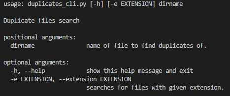
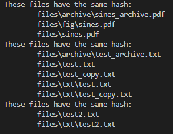
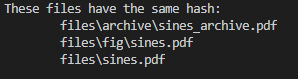

# a2-duplicate_files
Scan a directory tree and find duplicate files based on their hash

This assignment was inspired by Exercise 14.3 in ThinkPython 2e with code available at http://greenteapress.com/thinkpython2/code/find_duplicates.py.

Author: Kale Fordham 
# Problem statement
Utilizing functions in the modules `hash_functions.py` and `dir_functions.py`, a colleague put together initial code in `duplicates_cli.py`. This code allows you to specify a directory, and the program scans the directory recursively to find all files in this folder and sub-folders. For each file, its hash is calculated. A list of files with matching hash values is printed. These are potential duplicate files.

The goal is to:
1. Add docstrings and comments to functions in `duplicates_cli.py`
2. Change the code to use **MD5**, rather than **hash8** as the hashing algorithm. 
3. Add a command line interface inside the `cli()` function. The interface has one mandatory argument, `dirname`. Make sure to add command line description and argument help text.
4. Extend the code and command line interface with an optional argument to accept a file extension and only find duplicates with this file extension. The option should be `-e` and `--extension`. For text files, usage would be `-e .txt` or `--extension .txt`. Make sure to add help text.
5. (optional) Extend the code and command line interface to specify the hash algorithm used. Make sure to add help text.

# What to do
Work through goals 1. - 4. (optionally 5.) outlined above by editing `duplicates_cli.py` and using git to capture your changes. 

Document your code using the [style guide](StyleGuide.md). 

Using the sample file structure in the `files` folder, `python duplicates_cli.py files` should print
```
These files have the same hash:
        files/archive/sines_archive.pdf
        files/fig/sines.pdf
        files/sines.pdf
These files have the same hash:
        files/archive/test_archive.txt
        files/test.txt
        files/test_copy.txt
        files/txt/test.txt
        files/txt/test_copy.txt
These files have the same hash:
        files/test2.txt
        files/txt/test2.txt
```

`python duplicates_cli.py -e .pdf files` should print
```
These files have the same hash:
        files/archive/sines_archive.pdf
        files/fig/sines.pdf
        files/sines.pdf
```

Create a screenshots of your program running the following commands:
- `python duplicates_cli.py -h` 
- `python duplicates_cli.py files`
- `python duplicates_cli.py -e .pdf files`  
  
Create another screenshot of running tests `pytest -v duplicates_cli_test.py`. 

Edit `README.md` (this file) and include the screenshots and instructions how to run your code/tests in the *How to run this program* section below (similar to a0-classroom).

In the section *Reflection*, include what you liked or disliked; found interesting, confusing, challenging, motivating while working on this assignment.

Make sure final version of `duplicates_cli.py`, `README.md` and `screenshot1.png`, `screenshot2.png`, etc. are committed to git and pushed to github. 

# How to run this program
To run this program, it is treated as a command line interface (CLI) for users to interact with. To see all arguments and functionalities of the function, type in `duplicates_cli.py -h` or `duplicates_cli.py --help` to preview. The following should show up when entered:




From here, you can see that `duplicates_cli.py` has one main argument, `dirname`. This is the name that will be used to search for similar files. To use this CLI, type in any directory name to be searched for, for example `files`. Type in `duplicates_cli.py files`, and the following output should show:




With this CLI, you can also add an extension argument. This searches for for files with the same directory name, but also the same extension, such as `.pdf`. To utilize this argument, simply type in `-e` or `--extension`, followed by any extension you want to search for. As an example, type in `duplicates_cli.py -e .pdf files`, and expect the following output:



# Reflection
This assignment was a bit challenging, especially when checking to see if there was a specific extension to filter for. Nonetheless, it was a great learning experience and helped me to strengthen my problem solving skills. I thought this assignment was challenging, but I did enjoy working through the problems and it felt good when all the code finally worked. I think CLIs can be very useful in many cases, and this assignment showed that. Trying to search through files on a computer that may be rather unorganized can make a simple task rather very easy with a CLI like the one made in this assignment.

